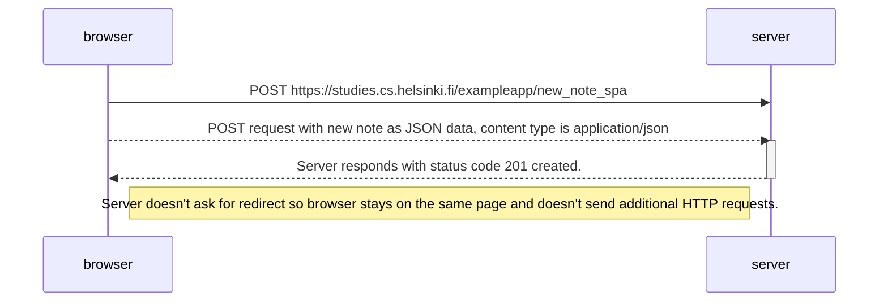

```mermaid
sequenceDiagram
    participant browser
    participant server

    browser->>server: POST https://studies.cs.helsinki.fi/exampleapp/new_note_spa
    browser-->>server: POST request with new note as JSON data, content type is application/json
    activate server
    server-->>browser: Server responds with status code 201 created.
    deactivate server

    Note left of server: Server doesn't ask for redirect so browser stays on the same page and doesn't send additional HTTP requests.
```